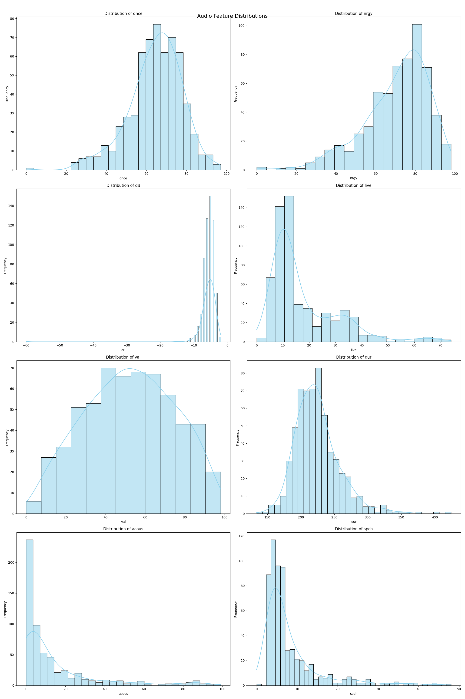
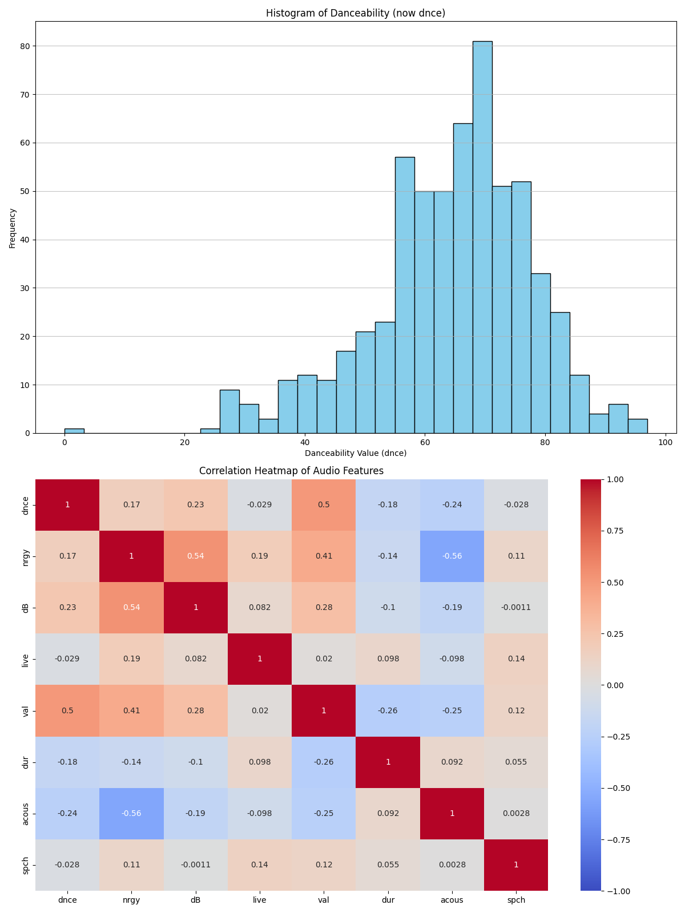

# Music Streaming and Song Recommendations Using ML Algorithms

## Project Overview
This capstone project investigates the algorithms used by music streaming services to recommend similar songs and enhance user experiences. The focus is on how platforms like Spotify and Apple Music use listeners' preferences to create personalized playlists.

## Key Objectives
- Analyze open datasets from Spotify and MusicBrainz
- Develop a test system for song recommendations based on user behavior and preferences
- Explore machine learning methods such as collaborative filtering and content-based analysis
- Address challenges in current recommendation algorithms

## Data Sources
- [Spotify Million Playlist Dataset](https://www.kaggle.com/datasets/shubhendra/million-playlist-dataset)
- [Spotify Web API](https://developer.spotify.com/documentation/web-api/)
- [MusicBrainz Database](https://musicbrainz.org/)

## Key Findings

### Audio Feature Distribution

*Figure 1: Distribution of key audio features (danceability, energy, valence, and tempo)*

- Most audio features exhibit normal distributions
- Valence shows a slight positive skew, indicating a tendency towards more positive-sounding tracks

### Feature Correlations

*Figure 2: Correlation heatmap of audio features*

- Strong positive correlation (0.76) between energy and loudness
- Acousticness shows negative correlations with energy (-0.72) and loudness (-0.59)
- Moderate positive correlation (0.39) between danceability and valence

## Conclusions
1. The balanced distribution of audio features suggests a diverse dataset
2. Strong correlations between certain features (e.g., energy and loudness) indicate their importance in music perception
3. The relationship between danceability and valence suggests potential for mood-based playlist creation
4. Content-based recommendation systems provide consistent suggestions but may lack serendipity in discovering new music styles

## Future Work
- Incorporate collaborative filtering to balance content-based recommendations with user preferences
- Explore time-based features to capture evolving music trends
- Implement diversity measures to ensure a mix of familiar and novel recommendations

## Project Deliverables
- [Full Project Report (PDF)](link_to_your_report.pdf)
- [Jupyter Notebook with Analysis](link_to_your_notebook.ipynb)
- [Presentation Slides](link_to_your_slides.pdf)

## Tools and Technologies Used
- Python (Pandas, NumPy, Matplotlib, Seaborn)
- Spotify Web API
- Jupyter Notebooks
- LaTeX (for report writing)

## Author
Anthony M. Schomer
Northwest Missouri State University

# Music Streaming and Song Recommendations

## Project Overview
This project explores algorithms used by music streaming services to recommend songs based on user preferences. It utilizes machine learning techniques to enhance user experience through personalized playlists.

## Table of Contents
- [Project Overview](#project-overview)
- [Exploratory Data Analysis (EDA)](#exploratory-data-analysis-eda)
- [Machine Learning Component](#machine-learning-component)
- [Installation](#installation)
- [Usage](#usage)
- [License](#license)

## Exploratory Data Analysis (EDA)

### Introduction
Exploratory Data Analysis (EDA) is a crucial step in understanding the dataset and uncovering patterns that inform our recommendation algorithms.

### Key Findings
- **Distribution of Audio Features**: The distribution of key audio features such as danceability, energy, and tempo was analyzed.
- **Insights**: The analysis provided insights into how different audio features relate to each other and their potential impact on user preferences.

### Conclusion
The insights gained from the EDA will guide the development of our recommendation system by highlighting important features that influence user preferences.

## Machine Learning Component
Details about the machine learning algorithms used, training/testing processes, and results will be included here.
Please mix this together for my readme file
